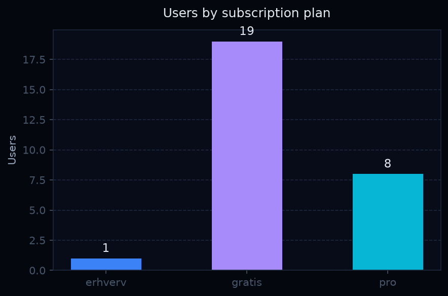
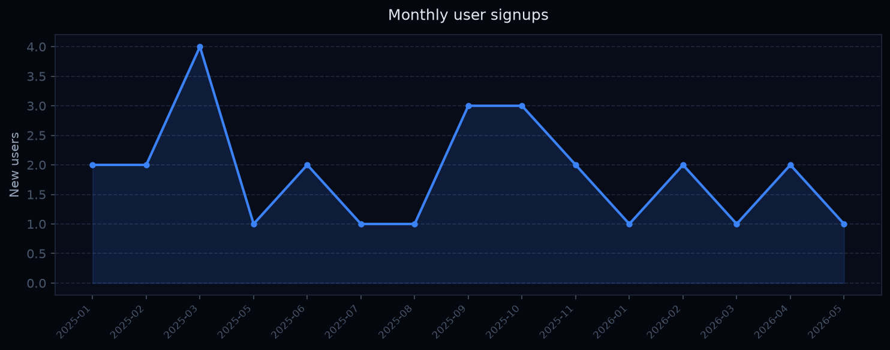
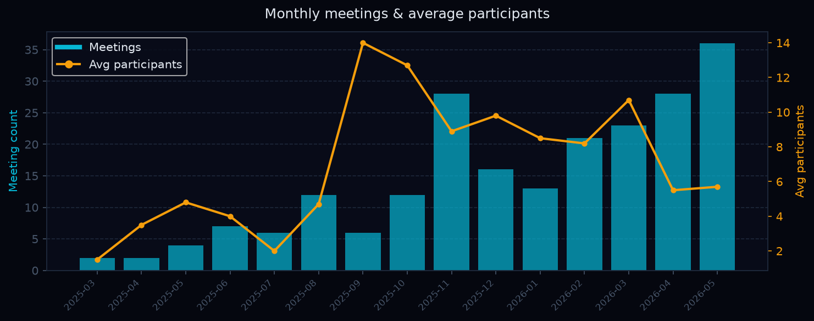
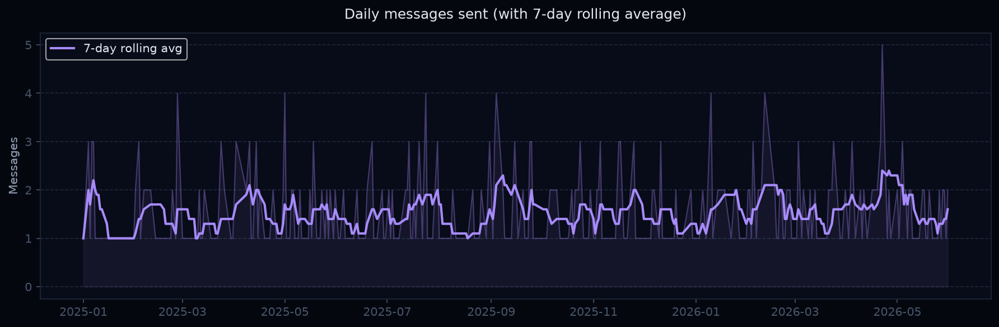
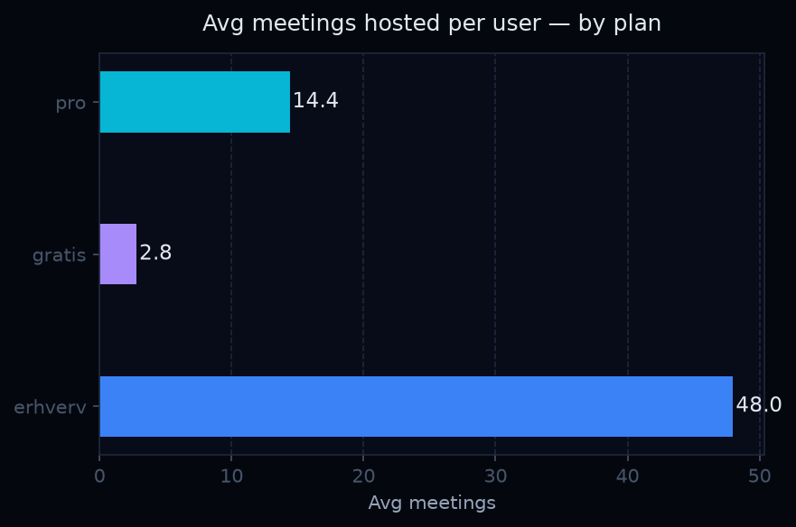

# Lysbro Analytics Pipeline

An ETL data pipeline that extracts, transforms and loads usage data from the [Lysbro](https://lysbro.com) video conferencing platform into an analytics-ready reporting database, with visualisations in a Jupyter Notebook.

---

## What it does

```
generate_data.py  →  output/lysbro.db          (raw data — simulates production extract)
etl.py            →  output/lysbro_analytics.db (transformed aggregates)
analysis.ipynb    →  output/*.png               (charts and insights)
```

**Pipeline steps:**

1. **Extract** — reads raw tables (users, meetings, participants, messages) from SQLite
2. **Transform** — produces 7 analytics aggregates using pandas
3. **Load** — writes results into a separate reporting database

---

## Analytics produced

| Table | Description |
|---|---|
| `plan_distribution` | User count per subscription tier |
| `monthly_signups` | New user registrations over time |
| `monthly_meetings` | Meeting volume + avg participants per month |
| `top_hosts` | Most active users by meetings hosted |
| `rsvp_summary` | Meeting invitation acceptance / decline rate |
| `daily_messages` | Message volume with 7-day rolling average |
| `meetings_per_user_by_plan` | Avg meetings hosted broken down by plan |

---

## Charts

| | |
|---|---|
|  |  |
|  |  |
|  |  |

---

## Tech stack

- **Python 3.12** — pipeline and data generation
- **pandas** — data transformation and aggregation
- **SQLite** — lightweight source and reporting database
- **matplotlib** — visualisations
- **Jupyter Notebook** — interactive analysis
- **supabase-py** — production connection layer (see note below)

---

## Setup

```bash
python3 -m venv venv
source venv/bin/activate
pip install -r requirements.txt
```

**Run the full pipeline:**

```bash
python generate_data.py   # generate test data
python etl.py             # run ETL
jupyter notebook analysis.ipynb  # open visualisations
```

---

## Note on data

`generate_data.py` creates realistic synthetic data (28 users, ~170 meetings, 500 messages) that mirrors the Lysbro production schema. This keeps the repo self-contained and avoids exposing real user data.

In production, `etl.py` would connect directly to the Supabase PostgreSQL database using the connection string from `.env`.
